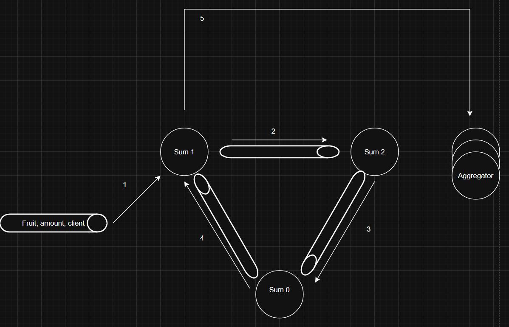
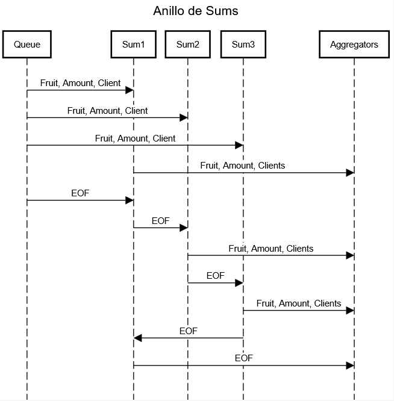
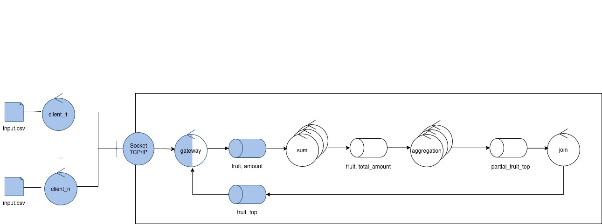

### Ejecución
No se modificó el makefile, por lo que se ejecuta del mismo modo que se indica en el readme base.
# Informe
## Modificacion del protocolo de mensajes
Para identificar a que cliente pertenece cada mensaje se agregó en la clase de MessageHandler del Cliente la generación de un UUID de tal modo que los mensajes se ven modificados de la siguiente forma:
```
Envio de fruta: [fruta, cantidad]   ->  [fruta, cantidad, UUID]
End of File:    []                  ->  [UUID]
```
## Coordinacion de Sums
Ahora sum no solo escucha a la cola principal, sino que además tiene una cola de entrada y otra de salida con otras instancias de sum, formando un anillo entre ellas. La idea es el EOF le llega a una instancia, esta misma manda sus datos a los aggregators y luego no manda el EOF a los aggregators, sino que se lo manda al anillo. Cuando una instancia lo recibe por el anillo procede a mandar los datos calculados y luego se lo pasa a la siguiente instancia del anillo. Eventualmente va a volver a llegar a la primera instancia, y recién ahí se le envía el EOF a los aggregators.




Internamente cada instancia tiene un hilo separado para escuchar el anillo, y se tiene un lock en conjunto de modo tal que si se está procesando un mensaje de la cola principal, no se pueda procesar en paralelo un mensaje de la cola, dado que los mensajes se están procesando de a 1 no se tiene un buffer de mensajes sin procesar que requieran ser procesados antes de procesar el mensaje del anillo.

A pesar de Python contar con el mutex general del GIL, se tiene en cuenta que al tener las operaciones bloqueantes de las queues de rabbitmq, las cuales Pika menciona que no son thread safe (https://pika.readthedocs.io/en/stable/faq.html) se pueden dar casos reales de concurrencia y race conditions que el sistema debe solucionar que exceden al GIL.

## Uso de los Aggregators
Se separan las frutas convirtiendo sus letras a numero, sumandolas y tomando módulo sobre la cantidad de aggregators, de ahí que se elige a cual aggregator enviarlo. Esto garantiza que todas las operaciones de una fruta las maneje siempre el mismo aggregator. Respecto al EOF, se optó que el Sum lo broadcasteé a todos las instancias de Aggregators, haciendo que no sea necesario el anillo en este caso. Una vez recibido el EOF, cada aggregator arma su top 3 local de sus frutas y se lo envía al join, cuando el join recibe todos los tops de los aggregators arma el top 3 final.
# Trabajo Práctico - Coordinación

En este trabajo se busca familiarizar a los estudiantes con los desafíos de la coordinación del trabajo y el control de la complejidad en sistemas distribuidos. Para tal fin se provee un esqueleto de un sistema de control de stock de una verdulería y un conjunto de escenarios de creciente grado de complejidad y distribución que demandarán mayor sofisticación en la comunicación de las partes involucradas.

## Ejecución

`make up` : Inicia los contenedores del sistema y comienza a seguir los logs de todos ellos en un solo flujo de salida.

`make down`:   Detiene los contenedores y libera los recursos asociados.

`make logs`: Sigue los logs de todos los contenedores en un solo flujo de salida.

`make test`: Inicia los contenedores del sistema, espera a que los clientes finalicen, compara los resultados con una ejecución serial y detiene los contenederes.

`make switch`: Permite alternar rápidamente entre los archivos de docker compose de los distintos escenarios provistos.

## Elementos del sistema objetivo


*Fig. 1: Diagrama de Robustez*

### Client

Lee un archivo de entrada y envía por TCP/IP pares (fruta, cantidad) al sistema.
Cuando finaliza el envío de datos, aguarda un top de pares (fruta, cantidad) y vuelca el resultado en un archivo de salida csv.
El criterio y tamaño del top dependen de la configuración del sistema. Por defecto se trata de un top 3 de frutas de acuerdo a la cantidad total almacenada.

### Gateway

Es el punto de entrada y salida del sistema. Intercambia mensajes con los clientes y las colas internas utilizando distintos protocolos.

### Sum
 
Recibe pares  (fruta, cantidad) y aplica la función Suma de la clase `FruitItem`. Por defecto esa suma es la canónica para los números enteros, ej:

`("manzana", 5) + ("manzana", 8) = ("manzana", 13)`

Pero su implementación podría modificarse.
Cuando se detecta el final de la ingesta de datos envía los pares (fruta, cantidad) totales a los Aggregators.

### Aggregator

Consolida los datos de las distintas instancias de Sum.
Cuando se detecta el final de la ingesta, se calcula un top parcial y se envía esa información al Joiner.

### Joiner

Recibe tops parciales de las instancias del Aggregator.
Cuando se detecta el final de la ingesta, se envía el top final hacia el gateway para ser entregado al cliente.

## Limitaciones del esqueleto provisto

La implementación base respeta la división de responsabilidades de los distintos controles y hace uso de la clase `FruitItem` como un elemento opaco, sin asumir la implementación de las funciones de Suma y Comparación.

No obstante, esta implementación no cubre los objetivos buscados tal y como es presentada. Entre sus falencias puede destactarse que:

 - No se implementa la interfaz del middleware. 
 - No se dividen los flujos de datos de los clientes más allá del Gateway, por lo que no se es capaz de resolver múltiples consultas concurrentemente.
 - No se implementan mecanismos de sincronización que permitan escalar los controles Sum y Aggregator. En particular:
   - Las instancias de Sum se dividen el trabajo, pero solo una de ellas recibe la notificación de finalización en la ingesta de datos.
   - Las instancias de Sum realizan _broadcast_ a todas las instancias de Aggregator, en lugar de agrupar los datos por algún criterio y evitar procesamiento redundante.
  - No se maneja la señal SIGTERM, con la salvedad de los clientes y el Gateway.

## Condiciones de Entrega

El código de este repositorio se agrupa en dos carpetas, una para Python y otra para Golang. Los estudiantes deberán elegir **sólo uno** de estos lenguajes y realizar una implementación que funcione correctamente ante cambios en la multiplicidad de los controles (archivo de docker compose), los archivos de entrada y las implementaciones de las funciones de Suma y Comparación del `FruitItem`.


*Fig. 2: Elementos mutables e inmutables*

A modo de referencia, en la *Figura 2* se marcan en tonos oscuros los elementos que los estudiantes no deben alterar y en tonos claros aquellos sobre los que tienen libertad de decisión.
Al momento de la evaluación y ejecución de las pruebas se **descartarán** o **reemplazarán** :

- Los archivos de entrada de la carpeta `datasets`.
- El archivo docker compose principal y los de la carpeta `scenarios`.
- Todos los archivos Dockerfile.
- Todo el código del cliente.
- Todo el código del gateway, salvo `message_handler`.
- La implementación del protocolo de comunicación externo y `FruitItem`.

Redactar un breve informe explicando el modo en que se coordinan las instancias de Sum y Aggregation, así como el modo en el que el sistema escala respecto a los clientes y a la cantidad de controles.
